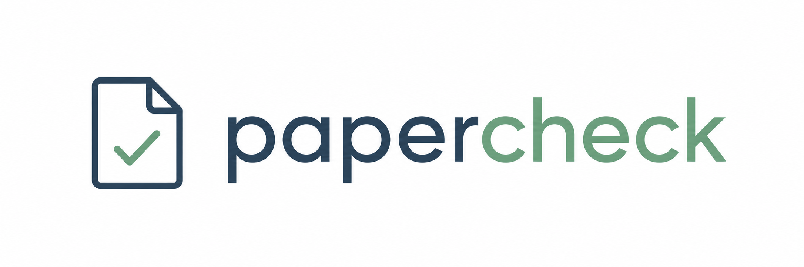
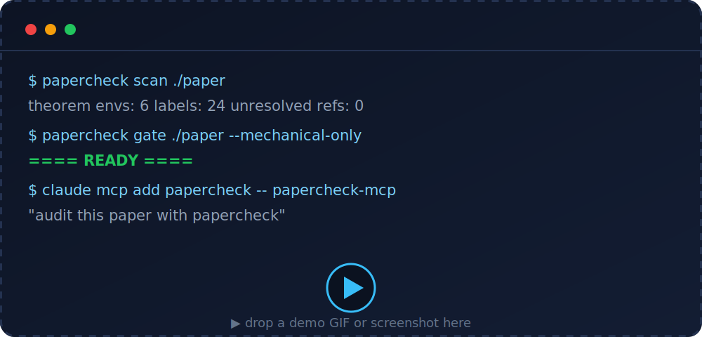
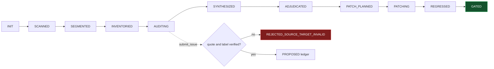

<a name="readme-top"></a>

<div align="center">



<br/>

**Turn a mathematical paper into a stage-gated adversarial audit — deterministic structure extraction, schema-validated issue ledgers with mechanical quote verification, and a final gate that any MCP-capable agent can drive but cannot skip.**

<br/>

<!-- badges -->
<a href="https://github.com/cgarryZA/papercheck/blob/main/LICENSE"></a>
<a href="https://www.python.org/"></a>


<a href="https://modelcontextprotocol.io"></a>

<br/>

<a href="https://github.com/cgarryZA/papercheck/stargazers"></a>
<a href="https://github.com/cgarryZA/papercheck/network/members"></a>
<a href="https://github.com/cgarryZA/papercheck/issues"></a>

<br/><br/>

<!-- nav -->
<a href="#what-it-is"></a>
<a href="#why"></a>
<a href="#quickstart"></a>
<a href="#mcp"></a>
<a href="#how-it-works"></a>
<a href="#commands"></a>
<a href="#limitations"></a>
<a href="#about"></a>

</div>

<br/>

> **papercheck** doesn't ask one model to "review the paper." It builds a review *machine*: segment the manuscript, inventory the claims, run narrow hostile audits, verify every finding against the exact source, adjudicate, patch only what's accepted, then gate. The gates are enforced in **code**, not prose — an agent can drive the whole thing but cannot skip adjudication or slip an unverifiable finding into the ledger.

<br/>

<div align="center">
<!-- Replace this placeholder with a real demo GIF / screenshot -->

</div>

<br/>

<a name="what-it-is"></a>
## 🔎 What it is
<a href="#readme-top"></a>

papercheck is a reproducible audit harness for **LaTeX mathematics papers**. It is a deterministic Python core exposed through a **CLI** and an **MCP server**, so any MCP-capable agent (Claude Code, Codex, Cursor, …) supplies the mathematical judgement while papercheck supplies the mechanism, the memory, and the guardrails.

In 10 seconds, it gives you:

- 🧩 **Deterministic structure extraction** — a LaTeX-AST scanner (theorems, labels, refs, citations, equations, draft markers) → `structure.json`.
- 🧾 **Schema-validated issue ledgers** — every finding is JSON, validated, and traceable to an exact source location.
- ✅ **Mechanical quote verification** — a finding whose quote doesn't match the source is **rejected before it enters the ledger**.
- 🚦 **A stage-gated state machine** — `INIT → SCANNED → … → ADJUDICATED → … → GATED`; patches are refused before adjudication.
- 🌐 **CLI + MCP + web UI** — script it, drive it from an agent, or browse the audit in your browser.

<br/>

<a name="why"></a>
## 💡 Why
<a href="#readme-top"></a>

A single "review my paper" prompt fails in three ways. papercheck kills each one **mechanically**:

| Failure mode | What usually happens | papercheck's mechanical fix |
| --- | --- | --- |
| **Hallucinated findings** | The model invents a problem that isn't in the text | `submit_issue` matches the exact quote against the source; no match → `REJECTED_SOURCE_TARGET_INVALID`, never reaches the ledger |
| **Patch-before-proof** | The model starts rewriting before anyone knows what's real | Patches are refused unless the state machine is at `ADJUDICATED` and the issue is `ACCEPTED` |
| **Skipped gate** | "Looks good to me" with no audit trail | The final gate is computed in code from mechanical signals + accepted blockers, and returns one of a fixed verdict set |

<br/>

<a name="quickstart"></a>
## 🚀 Quickstart
<a href="#readme-top"></a>

```bash
pipx install papercheck        # or: pip install papercheck

papercheck scan     path/to/paper     # extract structure.json
papercheck segments path/to/paper     # propose audit segments + budgets
papercheck gate     path/to/paper --mechanical-only   # -> READY / NOT READY ...
papercheck report   path/to/paper     # self-contained HTML report
papercheck serve    path/to/paper     # interactive local web UI
```

Try it on the bundled example (prints `==== READY ====`):

```bash
papercheck gate examples/toy_clean_paper --mechanical-only
```

<br/>

<a name="mcp"></a>
## 🤖 Drive it from an agent (MCP)
<a href="#readme-top"></a>

papercheck ships a **FastMCP** server exposing **29 tools** + the audit prompt pack. Register it once:

```bash
claude mcp add papercheck -- papercheck-mcp
```

Then just ask your agent:

> *"Audit the paper in `./paper` with papercheck."*

The agent walks the workflow through the MCP tools — `init_audit → run_scan → propose_segments → submit_issue → adjudicate_issue → run_gate` — and **cannot** patch before adjudication or submit a finding whose quote doesn't match the source. The intelligence is the agent's; the discipline is papercheck's.

<details>
<summary><b>Generate a paper-specific domain pack (no LLM inside papercheck)</b></summary>

<br/>

papercheck never calls a model itself. To tailor the audit to a paper's field, the agent reads the paper and papercheck validates + persists the result:

```bash
papercheck packs scaffold --paper-root ./paper            # deterministic draft from the scan
papercheck packs create draft.json --paper-root ./paper   # validated -> Paper_Audit/domain_pack.json
```

Or via the MCP tools `scaffold_domain_pack` / `create_domain_pack`. Generic packs ship for stochastic analysis, PDE, numerical analysis, optimization, machine-learning theory, and a fully generic `general` pack.

</details>

<br/>

<a name="how-it-works"></a>
## 🧠 How it works
<a href="#readme-top"></a>



One deterministic core, two thin frontends, zero LLM calls inside the harness. The model lives in **your** agent (or your hands, via the CLI). papercheck stays strictly an MCP server + CLI — **no provider adapters, no self-orchestration** — so it works with any model and sends nothing over the network itself.

<br/>

<a name="commands"></a>
## 🛠 Commands
<a href="#readme-top"></a>

| Command | What it does |
| --- | --- |
| `papercheck init` | Create the `Paper_Audit/` workspace + state file |
| `papercheck scan` | LaTeX-AST structure extraction → `structure.json` |
| `papercheck segments` | Heuristic segment + budget proposal |
| `papercheck gate [--mechanical-only]` | Compute the final verdict (exit 0 = READY) |
| `papercheck verify-quote` | Check a quote against a source file |
| `papercheck report` | Self-contained HTML audit report |
| `papercheck serve` | Interactive local web UI (filter issues, click-to-source) |
| `papercheck compare old/ new/` | Structural diff of two paper versions |
| `papercheck profile list\|show` | Advisory audit pipelines (`quick`, `arxiv`, `full`, …) |
| `papercheck packs …` | List / scaffold / create domain packs |
| `papercheck prompts list\|show` | The vendored audit prompt pack |
| `papercheck mcp` | Run the MCP server (stdio) |

<br/>

### 🔁 CI for your paper repo

A mechanical, **LLM-free** safety net you can drop into any paper repo — see [`docs/ci.md`](docs/ci.md). It runs `scan` + `gate --mechanical-only` on every PR and **never** sends your manuscript anywhere.

<br/>

<a name="limitations"></a>
## ⚠️ Limitations
<a href="#readme-top"></a>

Read [`docs/limitations.md`](docs/limitations.md) before trusting it. In short:

- ❌ **Not a theorem prover** and **not a replacement for peer review**.
- 🧠 Semantic error detection depends entirely on the **driving LLM** — papercheck makes it *disciplined and traceable*, not *omniscient*. AI findings must be independently checked.
- 🔒 **papercheck sends nothing over the network.** However, the **LLM agent you use to drive it may transmit your manuscript to its model provider.** Review your agent/provider's data terms before auditing unpublished work. See [`docs/privacy.md`](docs/privacy.md).

<br/>

<a name="about"></a>
## 👤 About
<a href="#readme-top"></a>

Built by **Christian Garry** — Graduate Communications Engineer at Siemens and MSc student in Scientific Computing & Data Analysis at Durham University. papercheck reflects a way of working: decompose a hard problem into small, well-defined components with explicit interfaces and hard guarantees, then compose them into a system you can trust.

<div align="center">
  <a href="https://www.linkedin.com/in/christian-tt-garry/"></a>
  <a href="https://christiangarry.com"></a>
</div>

<br/>

## 🤝 Contributing

PRs welcome — see [`CONTRIBUTING.md`](CONTRIBUTING.md). Good first issues: renderers, domain packs, new eval fixtures. The architecture is fixed for the 0.x line (strictly MCP + CLI, JSON as source of truth, gates enforced in code); prompt changes are guarded by the eval fixtures in [`docs/agent_eval.md`](docs/agent_eval.md).

## 📜 License & citation

MIT — see [`LICENSE`](LICENSE). If papercheck helps your work, cite it via [`CITATION.cff`](CITATION.cff).

<div align="center">
<br/>
<sub>If papercheck is useful to you, a ⭐ helps other people find it.</sub>
<br/><br/>
<a href="#readme-top"></a>
</div>
