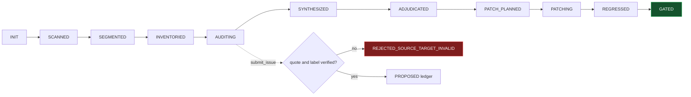

<div align="center">


<br/>

A reproducible audit harness for mathematical LaTeX papers.

<a href="https://github.com/cgarryZA/papercheck/blob/main/LICENSE"></a>
<a href="https://www.python.org/"></a>


<a href="https://modelcontextprotocol.io"></a>

</div>

papercheck extracts a paper's structure, records findings in schema-validated ledgers that are checked against the exact source text, and runs a final gate that reports whether the paper is ready. It runs as a command-line tool, or as an MCP server that an agent (Claude Code, Codex, Cursor, or similar) drives while you supply the mathematical judgement.

The point is discipline. Instead of asking one model to "review the paper," papercheck segments the manuscript, inventories the claims, runs narrow hostile audits, verifies each finding against the source, adjudicates, patches only what was accepted, and gates. The gates are enforced in code: an agent cannot patch before adjudication, and a finding whose quote does not appear in the source never enters the ledger.

The staged pipeline — segment, budget, specialist review, synthesize, adjudicate — follows the approach described in Google Research's Paper Assistant Tool (PAT) [[1]](#references), adapted into a small, open, model-agnostic harness that runs no models of its own.

## What it is

A deterministic Python core with two frontends — a CLI and an MCP server. papercheck itself never calls a model; the reasoning lives in the agent or in your hands at the CLI. What the core provides:

- LaTeX-AST structure extraction (theorems, labels, references, citations, equations, draft markers) into `structure.json`.
- Schema-validated issue ledgers, each finding tied to a file and line.
- Quote verification at intake: if a finding's quoted text is not in the source, it is rejected as `REJECTED_SOURCE_TARGET_INVALID` before it reaches the proposed ledger.
- A stage-gated state machine (`INIT → SCANNED → … → ADJUDICATED → … → GATED`) that refuses out-of-order operations.
- A CLI, an MCP server (29 tools), and a local web UI.

## Why

A single "review my paper" prompt tends to fail in three ways. papercheck handles each in code rather than in prompting:

| Failure mode | What usually happens | How papercheck handles it |
| --- | --- | --- |
| Hallucinated findings | the model invents a problem that isn't in the text | `submit_issue` matches the quoted text against the source; no match means the finding is rejected before it enters the ledger |
| Patch before proof | the model rewrites before anyone knows what is real | patches are refused unless the state is at `ADJUDICATED` and the issue is `ACCEPTED` |
| Skipped gate | "looks good to me" with no audit trail | the final gate is computed from mechanical signals and accepted blockers, and returns one of a fixed set of verdicts |

## Quickstart

```bash
pipx install papercheck        # or: pip install papercheck

papercheck scan     path/to/paper     # extract structure.json
papercheck segments path/to/paper     # propose audit segments and budgets
papercheck gate     path/to/paper --mechanical-only
papercheck report   path/to/paper     # self-contained HTML report
papercheck serve    path/to/paper     # local web UI
```

Run it on the bundled example (prints `==== READY ====`):

```bash
papercheck gate examples/toy_clean_paper --mechanical-only
```

## Driving it from an agent (MCP)

papercheck ships a FastMCP server exposing 29 tools plus the audit prompt pack. Register it once:

```bash
claude mcp add papercheck -- papercheck-mcp
```

Then ask the agent to audit a paper. It walks the workflow through the MCP tools — `init_audit`, `run_scan`, `propose_segments`, `submit_issue`, `adjudicate_issue`, `run_gate` — under the same code-enforced gates as the CLI.

<details>
<summary>Generating a paper-specific domain pack</summary>

<br/>

papercheck does not call a model, so tailoring the audit to a paper's field is a two-step split: the agent reads the paper and drafts the pack, papercheck validates and stores it.

```bash
papercheck packs scaffold --paper-root ./paper            # deterministic draft from the scan
papercheck packs create draft.json --paper-root ./paper   # validated -> Paper_Audit/domain_pack.json
```

The same is available through the `scaffold_domain_pack` and `create_domain_pack` MCP tools. Generic packs ship for stochastic analysis, PDE, numerical analysis, optimization, machine-learning theory, and a general fallback.

</details>

## How it works



One deterministic core, two frontends, no LLM calls inside the harness. papercheck stays strictly an MCP server and CLI — no provider adapters, no self-orchestration — so it works with any model and makes no network calls of its own.

## Commands

| Command | What it does |
| --- | --- |
| `papercheck init` | create the `Paper_Audit/` workspace and state file |
| `papercheck scan` | LaTeX-AST structure extraction into `structure.json` |
| `papercheck segments` | heuristic segment and budget proposal |
| `papercheck gate [--mechanical-only]` | compute the final verdict (exit 0 = READY) |
| `papercheck verify-quote` | check a quote against a source file |
| `papercheck report` | self-contained HTML audit report |
| `papercheck serve` | local web UI (filter issues, click through to source) |
| `papercheck compare old/ new/` | structural diff of two paper versions |
| `papercheck profile list\|show` | advisory audit pipelines (`quick`, `arxiv`, `full`, …) |
| `papercheck packs …` | list, scaffold, or create domain packs |
| `papercheck prompts list\|show` | the vendored audit prompt pack |
| `papercheck mcp` | run the MCP server (stdio) |

For a paper repository, [`docs/ci.md`](https://github.com/cgarryZA/papercheck/blob/main/docs/ci.md) describes a mechanical, LLM-free GitHub Action that runs `scan` and `gate --mechanical-only` on every pull request and sends nothing to any model provider.

## Limitations

See [`docs/limitations.md`](https://github.com/cgarryZA/papercheck/blob/main/docs/limitations.md) for the full version.

- papercheck is not a theorem prover and not a replacement for peer review.
- Catching a semantic error depends entirely on the driving model. papercheck keeps the process disciplined and traceable, but AI findings must be checked independently.
- papercheck makes no network calls. The agent you drive it with may transmit your manuscript to its model provider, so review the relevant data terms before auditing unpublished work ([`docs/privacy.md`](https://github.com/cgarryZA/papercheck/blob/main/docs/privacy.md)).

## About

Built by Christian Garry.

<a href="https://www.linkedin.com/in/christian-tt-garry/"></a>
<a href="https://christiangarry.com"></a>

## Contributing

Contributions welcome — see [`CONTRIBUTING.md`](https://github.com/cgarryZA/papercheck/blob/main/CONTRIBUTING.md). The architecture is fixed for the 0.x line: strictly MCP and CLI, JSON as the source of truth, gates enforced in code. Prompt changes are guarded by the eval fixtures described in [`docs/agent_eval.md`](https://github.com/cgarryZA/papercheck/blob/main/docs/agent_eval.md).

## References

<a name="references"></a>

1. Rajesh Jayaram, Drew Tyler, David Woodruff, Corinna Cortes, Yossi Matias, Vahab Mirrokni, and Vincent Cohen-Addad. *Towards Automating Scientific Review with Google's Paper Assistant Tool.* arXiv:2606.28277, 2026. <https://arxiv.org/abs/2606.28277>

BibTeX for the above is in [`docs/references.bib`](https://github.com/cgarryZA/papercheck/blob/main/docs/references.bib).

## License

MIT — see [`LICENSE`](https://github.com/cgarryZA/papercheck/blob/main/LICENSE). If papercheck is useful in your work, cite it via [`CITATION.cff`](https://github.com/cgarryZA/papercheck/blob/main/CITATION.cff).
